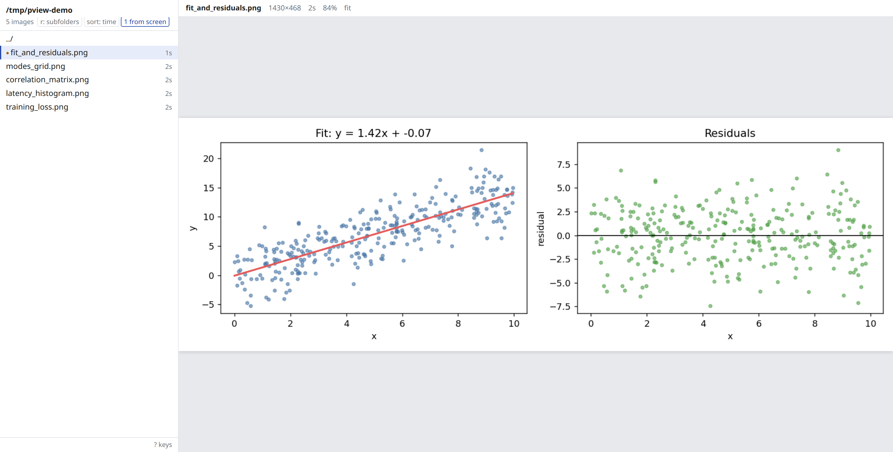

# pview

Look at plot images in a browser, driven from the terminal. File list on the left, one
image on the right, mouse wheel to zoom at the pointer, drag to pan. The list refreshes
itself, so plots from a run that just finished show up on their own.

It is for the case where you generate images on a machine you are ssh'd into — matplotlib
output, rendered reports, screenshots — and want to flip through them without leaving the
keyboard, and without fighting the limits of drawing images inside a terminal multiplexer.
The server runs where the files are and listens on 127.0.0.1 only; you reach it through an
ssh port forward, so nothing is exposed to other machines.



- Python 3 standard library only. No packages, no build step, no JavaScript dependencies.
- One key in tmux points it at the pane you are working in and pins the image paths that
  are visible on that pane's screen.
- A small server plus one HTML page.

## Install

```sh
git clone https://github.com/ancri/pview ~/src/pview
ln -s ~/src/pview/pview.py ~/.local/bin/pview      # anywhere on your PATH
```

By default pview serves images from your home folder only. To change that, list folders in
`~/.config/pview/roots`, one per line:

```
/data/experiments
/scratch/plots
```

`$PVIEW_ROOTS` (colon separated) overrides that file, and `$PVIEW_PORT` changes the port
(default 8765). `pview -h` prints the settings this install is actually using.

## Open it

| Where | What to do |
|---|---|
| Same machine | `http://localhost:8765/` |
| Over ssh, permanent | Add `LocalForward 8765 127.0.0.1:8765` to `~/.ssh/config` under the host you connect to, then open that URL locally |
| Over ssh, one-off | `ssh -N -L 8765:127.0.0.1:8765 <host>`, leave it running, open that URL |

If your ssh sessions share one connection per host (`ControlMaster`, which kitty's ssh
kitten turns on by default), a new `LocalForward` line applies to the next fresh
connection, not to sessions that are already open.

The server starts on its own the first time you run `pview` or press your tmux key.
`pview.service` is an optional systemd user unit if you want it up after a reboot.

## Drive it from the terminal

| Command | What it does |
|---|---|
| `pview` | Point the page at the current folder |
| `pview some/dir`, `pview plot.png` | Point it at a folder or a single image |
| `-r` | Include images in subfolders |
| `pview push PANE [DIR]` | Point it at DIR and pin the image paths visible in tmux pane PANE |
| `pview status` | Is the server up, what is it showing, is a browser tab connected |
| `pview stop` | Stop the server |
| `pview -h` | Keys, ssh setup, and this install's paths |

Each of these prints the URL, which most terminals let you click.

## tmux

Add one line to `~/.tmux.conf`, with the path to your clone:

```tmux
# Prefix + i: send this pane's folder to pview, and pin any image paths on its screen
bind-key i run-shell -b "$HOME/src/pview/pview.py push #{pane_id} #{q:pane_current_path}"
```

Reload with `tmux source-file ~/.tmux.conf`, or run that `bind-key` line once through the
`tmux` command to try it without reloading.

`#{pane_id}` and `#{q:pane_current_path}` are tmux formats: the pane the key was pressed
in, and its working folder, shell-quoted. `run-shell -b` runs the job in the background so
the key never blocks. pview answers with a one-line `display-message`, which includes the
URL when no browser tab is connected yet.

Pinning works like this: `tmux capture-pane` prints the pane's text, anything shaped like
an image path is pulled out, most recent mention first, and each one is checked against
the pane's folder. If it isn't there, the file whose path ends the same way wins, newest
first when several match. So a program that printed `plots/loss_curve.png` gets you that
file even when it sits three folders down. Full-screen programs (anything drawing on the
alternate screen) only expose the lines currently on display, which is usually exactly the
output you just read.

## Keys in the page

| Keys | Action |
|---|---|
| j k, arrows, g G | Move in the list |
| l or Enter, h or Backspace | Into a folder, up a folder |
| / | Filter the list (Enter keeps it, Esc clears) |
| r, s | Include subfolders, sort by time or name |
| wheel or pinch | Zoom at the pointer |
| drag, double click | Move the image, zoom in there and back to fit |
| 0 1 w + - | Fit, actual size, fit width, zoom in, zoom out |
| H J K L | Move the image from the keyboard |
| o, y | Open the image in a new tab, copy its path |
| ? | All of the above, plus the setup notes |

The list is newest first. If the newest file is selected, the selection follows the newer
one as it arrives, so a folder being written to behaves like a live view.

## What it will and will not serve

- Only files with an image extension (`png jpg jpeg gif webp svg bmp avif`), and only under
  the configured roots, resolved through symlinks before the check.
- Only on 127.0.0.1, and only for requests whose `Host` header is localhost. That last part
  is what stops a web page you have open from reaching the viewer through your forward by
  pointing its own name at 127.0.0.1.
- Nothing is written, renamed or deleted, there is no upload path, and no external
  converter is invoked. The one state-changing endpoint (`/api/push`) moves the viewer's
  own cursor and requires a header that a cross-site request cannot set.
- Image responses carry `Content-Security-Policy: default-src 'none'; sandbox`, so an SVG
  opened directly cannot run script against the viewer's origin.

## Limits

- Recursive listings stop at 2 seconds or 5000 images, breadth first, and the page then
  says "listing truncated". Point it at a folder nearer the images.
- Zooming past 100% is limited by the image's own resolution. If you plan to zoom, save
  plots at a higher dpi.
- A browser tab cannot close itself, so there is no quit key. Esc resets the zoom.
- A browser cannot show a PDF in an ``, so PDFs are not listed.

## License

MIT
